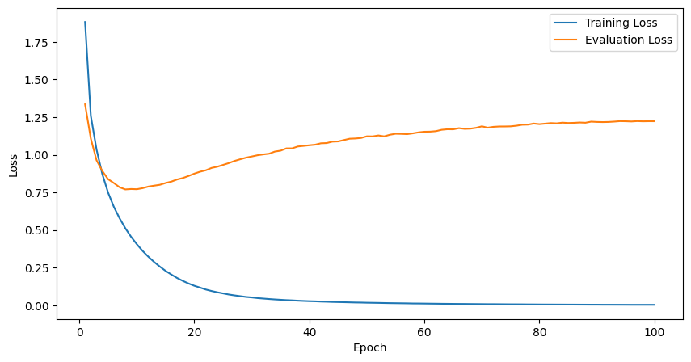

<!-- _class: lead -->

# 学科サーバー上でBARTのファインチューニング

nal研 ミニワークショップ2024(仮)

y20 Haruki.O

---

# はじめに

メインは「学科サーバー上でファインチューニングを実行するまでの流れ」です
- ベストプラクティスというわけではないです
- ミニワークショップ向けに用意してるので色々省いてます
- 基本的に書いてあること+ソースコードで完結してると思います

<br>

目的
- 学科サーバー上でSingularity/Slurmを触ってみる
- 翻訳タスクのファインチューニングを通じてなんとなく流れを掴む


---

# Singularity/Slurmって？
- 学科サーバー上のシステム
- Singularity: 仮想コンテナ技術(Dockerみたいなもの)
- Slurm: JOB管理システム

<br>

kwskはシス管様の資料を読もう！シス管様にBIG感謝
- [Singularityのすゝめ](https://ie.u-ryukyu.ac.jp/syskan/service/singularity/)
- [Slurmについて](https://ie.u-ryukyu.ac.jp/syskan/service/slurm/)

---

# ざっくりSingularity
- .sifファイルがコンテナイメージ
- Dockerからpullもできる
    - `singularity pull docker://huggingface/transformers-pytorch-gpu`
- .defファイルを書くことでビルドするコンテナをいじれる
    - defファイルを用意して`singularity build --fakeroot hoge.sif huga.def`
- (キャッシュファイルはデフォルトだと`$HOME/.sif/`に保存されると思います)

<br>

kwskはシス管様の資料を(ry)！
- [(再掲)Singularityのすゝめ](https://ie.u-ryukyu.ac.jp/syskan/service/singularity/)

---

# ざっくりSlurm
- 実行条件や実行コマンドを.sbatchファイルに記述
    - `sbatch hoge.sbatch`でJOB投入
- `squeue`で実行中のJOB確認
- `scancel JOBID`でキャンセル
- .sbatchファイルで指定したフォルダにログやエラーが格納される

<br>

kwskはシス管様の資料(ry)！
- [(再掲)Slurmについて](https://ie.u-ryukyu.ac.jp/syskan/service/slurm/)


---

# BARTファインチューニングまでの流れ

学科サーバー上で以下の作業をします
- 環境構築(sifファイルの用意)
    - 何が必要かを検討
    - ベースイメージの用意
    - .defファイルの記述
    - コンテナのビルド
- 実行したいプログラムの用意
- sbatchファイルの記述
- ジョブ投入

---

# 環境構築

## 何が必要かを検討
今回はTransformersライブラリを使ったファインチューニングを行う
→ [HuggingFaceが公開しているDockerイメージ](https://hub.docker.com/r/huggingface/transformers-pytorch-gpu/tags)があるのでそれを使うと良さそう

今回はデータセットはdatasetsライブラリにあるものを使おうかな
→ datasetsライブラリが必要そう

など検討していく


---

# ベースイメージの用意

以下を実行(pullにそこそこ時間かかるかも)
```
$ mkdir ~/sif
$ cd ~/sif
$ singularity pull docker://huggingface/transformers-pytorch-gpu:4.35.2
```
- (.defファイル内部で直接指定もできますが、一度pullしておくのが個人的におすすめなのでここでもそうしてます)
    - pullに時間がかかるので、一度pullしておいて使い回しやすいようにしておくとハッピーな気がする、という理由でおすすめしてます


---

# defファイルの記述...の前に

ファイルが増えていくので適当な作業ディレクトリを作ります
```
$ mkdir ~/workshop2024
$ cd ~/workshop2024
```

---

# defファイルの記述

env.defを作成し、以下を記述
```
BootStrap: localimage
From: /PATH/TO/transformers-pytorch-gpu_4.35.2.sif

%post
        pip install --upgrade pip
        pip install accelerate -U
        pip install transformers
        pip install evaluate
        pip install datasets
```
- 2行目`/PATH/TO`は前ページでpullしたイメージへのパスに書き換えます

((実際には、今回のベースイメージだとtransformersもevaluateもdatasetsも含まれていると思うので必要ないのですがなんとなく雰囲気を掴むために書いてます))

---

# コンテナのビルド

以下を実行します
```
$ singularity build --fakeroot env.sif env.def
```
- env.sifは`hoge.sif`でも`huga.sif`でも自分がわかりやすいようにつければおk
- ベースのイメージを既にpullしているので、あんまり時間はかからないと思います
- うまくいったら`env.sif`ができています
- 出来上がったら`singularity shell env.sif`でshellを起動して、環境内で必要なライブラリがimportできるかなどを確認しておくと必要ライブラリが入ってなかったら気付けるのでスムーズな気がします
    - `singularit shell`から抜けるには`exit`

---

# プログラムの用意

`bart_finetuning.py`を作成しま...した(長いので略、多分同梱してるはず)
ざっくり説明すると
- データセットはhttps://huggingface.co/datasets/alt を使用
    - 英語記事の翻訳タスク用データセット
- モデルは`facebook/bart-base`を使用
- 前処理はtokenize(単語のid化)とattention_maskの付与
- 学習率(`learning_rate`)は5e-5
    - TrainingArgumentクラスのデフォルトが5e-5なのでそれでやってみます
- 1epoch学習
    - 簡単化のために削ってます
    - お試しなら3~10epoch程度に増やすと良さそう

---

# sbatchファイルの記述

train.sbatchを作成して以下の通りに記述
```
#!/bin/bash
#SBATCH --job-name workshop-example
#SBATCH --output logs/%x-%j.log
#SBATCH --error logs/%x-%j.err
#SBATCH --nodes 1
#SBATCH --gpus tesla:1
#SBATCH --time 24:00:00

date
singularity exec --nv env.sif python3 bart_finetuning.py
date
```
- errorやlogはlogs/に保存されます
    - `mkdir logs`をしておきましょう(パスが存在しないと実行されません)

---

# ジョブ投入

`sbatch train.sbatch`でジョブを投入します
- `squeue`で確認してみましょう
- エラーは`logs/JOBNAME-JOBID.err`をチェック(`tail -f JOBNAME-JOBID.err`)
- 今回のタスクはそこそこ時間がかかるかも
    - お試しで100epoch実行してみたら8時間くらいでした
    - 学科サーバーを使うとだいぶ早い(主観)のでありがたいです
- 動くかをみたいだけなら動作確認が終わったら`scancel JOBID`しておkです

このスライドの主旨が「学科サーバーでファインチューニングをするまでの流れ」なのでスライド的にはここで終わりです
- 結果はおまけ1に書いておきます

---

# おわり

**学科サーバーの環境はとてもつよい**

本スライドは一サンプルに過ぎないので、詳しくはシス管様の資料を読もう！
- [Singularityのすゝめ](https://ie.u-ryukyu.ac.jp/syskan/service/singularity/)
- [Slurmについて](https://ie.u-ryukyu.ac.jp/syskan/service/slurm/)
- [システム構成](https://ie.u-ryukyu.ac.jp/syskan/server_configuration/)
    - (読むと学科サーバーがつよつよ環境というのがわかります)


---

# おまけ1: 学習結果(1/2)

Trainerクラスを用いると損失の値が`checkpoint-xxxx/trainer_state.json`に保存されているので、100epoch実行時の結果を使って図をplotしてみました↓


- 途中から過学習してそうだな〜というグラフになりました

--- 

# おまけ1: 学習結果(2/2)

100epoch終了時のBLEU (0~1)は**0.2734**でした
- [Google Cloud Translationのガイドを参考にすると](https://cloud.google.com/translate/automl/docs/evaluate?hl=ja#bleu)今回の結果はあんまり良くなさそう？

100epoch終了時のテストデータに対する生成文章の一つを紹介↓
```
入力 : Flaming debris ignited small grass fires next to the roads.
正解 : 炎をあげる破片は道横の小草を燃やした。
生成文 : 大きな破片が道路の隣の小さな草の玉を火のった。
```
- 破片・道・隣・小・草など単語レベルだと掠ってますね

　学習率を変えたり専用トークン・専用プロンプトを追加するなど改善の余地はたくさんあると思うのでやってみると楽しそうですね！(丸投げ)

---

# おまけ2: 容量に注意

学科サーバーの自分のディレクトリの容量をチェックしてみましょう

`du -sh ~/*/ ~/.*/`
- ここまでのものを実行してたらおそらく`~/sif/`や`~/workshop2024/`、`~/.singularity/`、`~/.cache/`がそこそこな容量(主観)になってるかと思います
- キャッシュやsifファイル、学習モデルのサイズがそこそこ大きくなりがち
- 実験などで使う分には全然大丈夫だと思いますが、使わなくなったものは圧縮したり手元に落とすなど整理しましょう

---

# おまけ3: .sbatchの記述

Slurmを使うだけならもっと記述少なくても動作確認できます。
こんなんでも動きます↓(hoge.sbatch)
```
#!/bin/bash
#SBATCH --output ./%x-%j.log
echo "Hello Slurm!"
```
- `sbatch hoge.sbatch`すると`hoge.sbatch-JOBID.log`に`Hello Slurm!`と出力されます
- GPU利用時などは`gpus`をちゃんと書かないとダメな気がします(そこの省略は試したことないのでわからないです)

書くのはそんなに手間ではないと思うので、ちゃんとわかるように書いておくと後々見返す時にわかりやすくていいのかなと思います

---

# おまけ4

本当に関係ないのですが、本スライドはmarpを使って作成しました
便利なのでおすすめです
- Markdownからスライドを作れる
    - 下書きにも便利
    - gitで管理しやすい
- VSCodeの拡張機能を入れるだけで使える
- CSSでデザインをいじれる
    - 本スライドはdefaultのテーマを少しだけいじってます